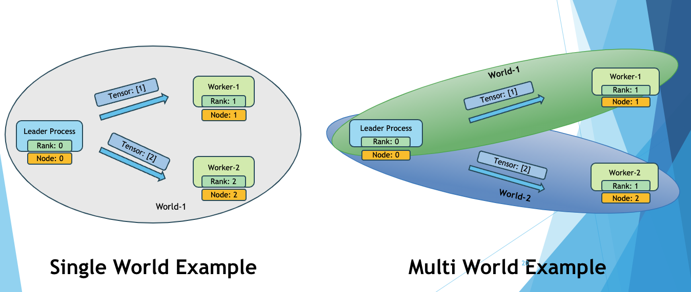

# MultiWorld Framework for PyTorch

## About

This repository implements `MultiWorld` framework for PyTorch. It enables fault management functionality for collective communication libraries (CCL) such as NCCL on top of the PyTorch distributed package. The fault management functionality includes (i) detection, (ii) tolerance (or resilience) and (iii) recovery. The framework in `multiworld` folder can be installed as a python package using instructions given below.

## Project Summary

<p align="center"></p>

### Background and Motivation

In the world of machine learning (ML) and artificial intelligence (AI), it's crucial for models to be reliable. But as ML models are used more and more in real life, they face all sorts of problems such as hardware and network failures. Since ML inference is a long-running service, it is crucial that ML inference workloads handle these problems fast and gracefully. Especially, as models become larger, it becomes unavoidable to deploy them across GPUs and hosts, which renders fault management challenging.

`MultiWorld` is an innovative framework aimed at supporting fault management in ML inference workloads. Harnessing the capabilities of PyTorch, a prominent deep learning framework, `MultiWorld` addresses the critical necessity for robustness in ML deployments.

### Key Contributions

The framework is built on top of PyTorch, a widely-used deep learning framework, and will support various backends such as NCCL and Gloo for distributed computing.

`MultiWorld` framework allows each worker to be a part of multiple worlds as displayed in the above figure. Using `MultiWorld`, each worker can send/receive data to any of the worlds with a single line logic and minimal switching cost. `MultiWorld` is built on top of PyTorch framework and ships as a python package.

`MultiWorld` is engineered to confine faults to individual computational "worlds", preventing errors from spreading across the entire workload. This means that if something goes wrong in one worker, the worlds where the worker belongs will be only affected, but it won't affect the others. Despite adding fault management mechanisms, `MultiWorld` maintains the integrity of each computational context, preserving the underlying structure and minimizing overhead. This approach allows developers to enhance fault management without requiring significant changes to their existing codebase or workflow. In many cases, the developers only need to replace PyTorch's  send/recv with the counter part of `MultiWorld` (send/recv under WorldCommunicator's module).

## Folder Information

* [`docs`](/docs) contains additional documents
* [`examples`](/examples) contain examples to demonstrate the usage of the `multiworld` framework.
* [`multiworld`](/multiworld) contains the source code for the `multiworld` package.
* [`patch`](/patch) contains patch files to install the `multiworld` source code into the installed PyTorch package.
* [`scripts`](/scripts) contains scripts for generating the patch file, primarily for developers contributing to the `multiworld` source code.

## Key Source Files Information

* `multiworld/world_manager.py` contains `WorldManager` class to create and manage multiple worlds.
* `multiworld/world_communicator.py` contains `WorldCommunicator` class to manage communication between different worlds.
* `multiworld/watchdog.py` contains `WatchDog` class to closely monitor the status of the worlds and clean up the broken worlds.

## Dependencies and Version

* [PyTorch](https://pypi.org/project/torch/2.4.0/) version: `2.4.0`

## Installation

To use the latest official package,

```bash
pip install multiworld
```

To install the package from source,

```bash
pip install .
```

## Running Examples

The list of all examples that are available can be found in the [`examples`](/examples) folder.
We recommend to start with [`send_recv`](/examples/send_recv) example

## Contributors

<a href="https://github.com/cisco-open/pymultiworld/graphs/contributors">
  
</a>

## How to Contribute

If you wish to contribute or suggest any additional funtionalities, please check out [Contributing Guidelines](/CONTRIBUTING.md)

## Citation

```text
@misc{m8d2024,
      title={Enabling Elastic Model Serving with MultiWorld}, 
      author={Myungjin Lee and Akshay Jajoo and Ramana Rao Kompella},
      year={2024},
      eprint={2407.08980},
      archivePrefix={arXiv},
      primaryClass={cs.DC},
      url={https://arxiv.org/abs/2407.08980}, 
}
```

## License

[Apache License 2.0](LICENSE).
