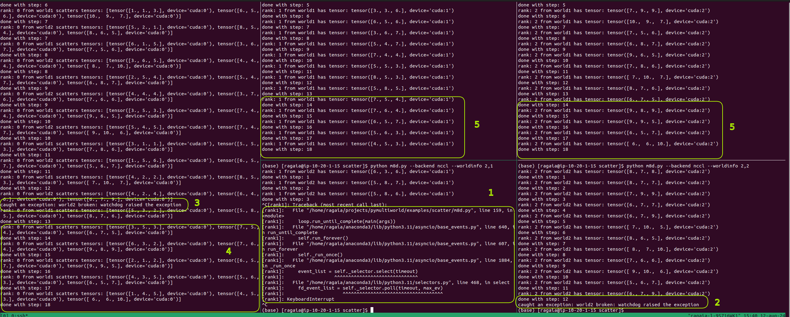

Scatter
=======

This file provides an example of collective communication using scatter
across single and multiple worlds. This exaplme will perform scatter 100
times with different source on each step. There are logs to indincate
how the tensors are scatterd from the source rank to the other ranks in
the world.

``--worldinfo`` argument is composed by the world index(1, 2) and the
rank in that world (0, 1 or 2).

Running the Script in a Single World
------------------------------------

The single world example can be executed by opening 3 separate terminal
windows to have 3 different processes and running the following commands
in each terminal window:

.. code:: bash

   # on terminal window 1 - will initialize 2 worlds (world1 and world2) with rank 0
   python m8d.py --backend nccl --worldinfo 1,0 --worldinfo 2,0
   # on terminal window 2 - will initialize world1 with rank 1
   python m8d.py --backend nccl --worldinfo 1,1
   # on terminal window 3 - will initialize world1 with rank 2
   python m8d.py --backend nccl --worldinfo 1,2

Running the Script in Multiple Worlds
-------------------------------------

The multiple world example can be executed by opening 5 separate
terminal windows to have 5 different processes and running the following
commands in each terminal window:

.. code:: bash

   # on terminal window 1 - will initialize 2 worlds (world1 and world2) with rank 0
   python m8d.py --backend nccl --worldinfo 1,0 --worldinfo 2,0
   # on terminal window 2 - will initialize world1 with rank 1
   python m8d.py --backend nccl --worldinfo 1,1
   # on terminal window 3 - will initialize world1 with rank 2
   python m8d.py --backend nccl --worldinfo 1,2
   # on terminal window 4 - will initialize world2 with rank 1
   python m8d.py --backend nccl --worldinfo 2,1
   # on terminal window 5 - will initialize world2 with rank 2
   python m8d.py --backend nccl --worldinfo 2,2

To run processes on different hosts, ``--addr`` arugment can be used
witn host’s IP address.
(``python m8d.py --backend nccl --worldinfo 1,0 --worldinfo 2,0 --addr 10.20.1.50``)

Example output
--------------

Running rank 0 (leader), will have the following output:

.. code:: bash

   rank: 0 from world1 scatters tensors: [tensor([6., 6., 5.], device='cuda:0'), tensor([4., 7., 5.], device='cuda:0'), tensor([6., 8., 9.], device='cuda:0')] # tensors to be scatterd for world1
   rank: 0 from world2 scatters tensors: [tensor([4., 5., 4.], device='cuda:0'), tensor([6., 4., 7.], device='cuda:0'), tensor([7., 9., 6.], device='cuda:0')] # tensors to be scatterd for world1
   done with step: 1 # indicator that step 1 of 100 is done for world1
   done with step: 1 # indicator that step 1 of 100 is done for world2

Running rank 1 from world1, will have the following output:

.. code:: bash

   rank: 1 from world1 has tensor: tensor([4., 7., 5.], device='cuda:1') # tensor of rank 1 after scatter
   done with step: 1  # indicator that step 1 of 100 is done

Running rank 2 from world1, will have the following output:

.. code:: bash

   rank: 2 from world1 has tensor: tensor([6., 8., 9.], device='cuda:2') # tensor of rank 2 after scatter
   done with step: 1  # indicator that step 1 of 100 is done

The scatter source (rank 0) has a list of tensors:
``[tensor([6., 6., 5.], device='cuda:0'), tensor([4., 7., 5.], device='cuda:0'), tensor([6., 8., 9.], device='cuda:0')]``.
These tensors will be scaterd across one world (world1), to each rank.
Therefore, after the scatter operation, rank 1 will have
``tensor([4., 7., 5.], device='cuda:0')`` and rank 2 will have
tensor([6., 8., 9.], device=‘cuda:0’).

The same pattern applies to world2.

Failure case
------------

If something goes wrong in one worker, only the world where the worker
belongs will be affected, the other worlds will continue their workload.
In other words, Mutiworld prevents errors from spreading accross
multiple worlds. In this case, if rank1 from world1 fails, rank 0
(source) will keek broadcast tensors to ranks from world2.

The following screenshot demonstrates how errors are handled in
multiworld:

Explanation:

1. Process is killed using keyboard interrupt on rank 1 from world 2
2. The exception is caught by all the workers in the same world (rank 2
   from world 2 in this example)
3. The exception is also caught by the lead worker (rank 0)
4. The lead worker (rank 0) continues to scatter tensor to the remaining
   worlds (world 1 in this example)
5. The scatter operation will continue for every other world that didn’t
   had an error and the lead worker will be the source for the scatter
   operation
