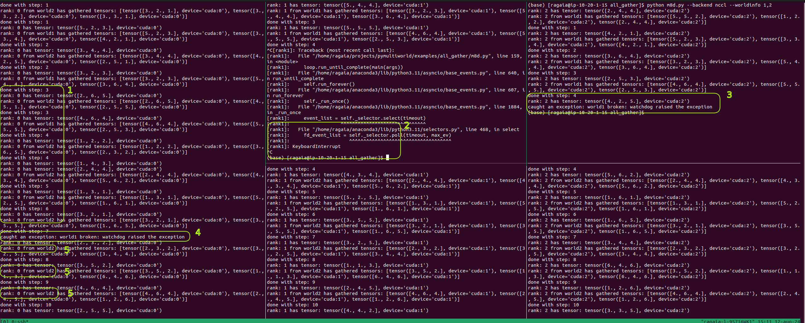

# All Gather

This file provides an example of collective communication using all_gather across single and multiple worlds. This exaplme will perform all_gather 100 times on each rank from each world.

`--worldinfo` argument is composed by the world index(1, 2) and the rank in that world (0, 1 or 2).

## Running the Script in a Single World

The single world example can be executed by opening 3 separate terminal windows to have 3 different processes and running the following commands in each terminal window:

```bash
# on terminal window 1 - will initialize 2 worlds (world1 and world2) with rank 0
python m8d.py --backend nccl --worldinfo 1,0 --worldinfo 2,0
# on terminal window 2 - will initialize world1 with rank 1
python m8d.py --backend nccl --worldinfo 1,1
# on terminal window 3 - will initialize world1 with rank 2
python m8d.py --backend nccl --worldinfo 1,2
```

## Running the Script in Multiple Worlds

The multiple world example can be executed by opening 5 separate terminal windows to have 5 different processes and running the following commands in each terminal window:

```bash
# on terminal window 1 - will initialize 2 worlds (world1 and world2) with rank 0
python m8d.py --backend nccl --worldinfo 1,0 --worldinfo 2,0
# on terminal window 2 - will initialize world1 with rank 1
python m8d.py --backend nccl --worldinfo 1,1
# on terminal window 3 - will initialize world1 with rank 2
python m8d.py --backend nccl --worldinfo 1,2
# on terminal window 4 - will initialize world2 with rank 1
python m8d.py --backend nccl --worldinfo 2,1
# on terminal window 5 - will initialize world2 with rank 2
python m8d.py --backend nccl --worldinfo 2,2
```

To run processes on different hosts, `--addr` arugment can be used witn host's IP address. (`python m8d.py --backend nccl --worldinfo 1,0 --worldinfo 2,0 --addr 10.20.1.50`)

## Example output

Running rank 0 (leader), will have the following output:

```bash
rank: 0 has tensor: tensor([1., 5., 5.], device='cuda:0') # initial tensor for world1
rank: 0 has tensor: tensor([2., 4., 3.], device='cuda:0') # initial tensor for world2
rank: 0 from world1 has gathered tensors: [tensor([1., 5., 5.], device='cuda:0'), tensor([4., 4., 4.], device='cuda:0'), tensor([2., 2., 5.], device='cuda:0')] # gathered tensors from all workers from world1
done with step: 1 # indicator that step 1 of 100 is done for world1
rank: 0 from world2 has gathered tensors: [tensor([2., 4., 3.], device='cuda:0'), tensor([4., 3., 3.], device='cuda:0'), tensor([2., 6., 5.], device='cuda:0')] # gathered tensors from all workers from world2
done with step: 1 # indicator that step 1 of 100 is done for world2
```

Running rank 1 from world1, will have the following output:

```bash
rank: 1 has tensor: tensor([4., 4., 4.], device='cuda:1') # initial tensor for rank 1 from world1
rank: 1 from world1 has gathered tensors: [tensor([1., 5., 5.], device='cuda:1'), tensor([4., 4., 4.], device='cuda:1'), tensor([2., 2., 5.], device='cuda:1')] # gathered tensors from all workers from world1
done with step: 1 # indicator that step 1 of 100 is done for world1
```

Running rank 2 from world1, will have the following output:

```bash
rank: 2 has tensor: tensor([2., 2., 5.], device='cuda:2') # initial tensor for rank 2 from world1
rank: 2 from world1 has gathered tensors: [tensor([1., 5., 5.], device='cuda:2'), tensor([4., 4., 4.], device='cuda:2'), tensor([2., 2., 5.], device='cuda:2')] # gathered tensors from all workers from world1
done with step: 1 # indicator that step 1 of 100 is done for world1
```

The following table provides a visual representation on how all tensors are being gathered across one world:

| Rank        | Tensor                                                                 | Result                                                                                                                                                                                                                   |
| :---        | :----                                                                  | :---                                                                                                                                                                                                                     |
| 0           | <span style="color: red">tensor([1., 5., 5.], device='cuda:0')</span>  | [<span style="color: red">tensor([1., 5., 5.], device='cuda:2')</span>, <span style="color: green">tensor([4., 4., 4.], device='cuda:2')</span>, <span style="color: blue">tensor([2., 2., 5.], device='cuda:2')</span>] |
| 1           | <span style="color: green">tensor([4., 4., 4.], device='cuda:1')</span>| [<span style="color: red">tensor([1., 5., 5.], device='cuda:2')</span>, <span style="color: green">tensor([4., 4., 4.], device='cuda:2')</span>, <span style="color: blue">tensor([2., 2., 5.], device='cuda:2')</span>] |
| 2           | <span style="color: blue">tensor([2., 2., 5.], device='cuda:2')</span> | [<span style="color: red">tensor([1., 5., 5.], device='cuda:2')</span>, <span style="color: green">tensor([4., 4., 4.], device='cuda:2')</span>, <span style="color: blue">tensor([2., 2., 5.], device='cuda:2')</span>] |

The same pattern applies to world2.

## Failure case

If something goes wrong in one worker, only the world where the worker belongs will be affected, the other worlds will continue their workload.
In other words, Mutiworld prevents errors from spreading accross multiple worlds.
In this case, if, for example rank 1 from world1 fails, ranks from world2 will still continue to perform all_gather operation, together with rank 0 (leader).

The following screenshot demonstrates how errors are handled in multiworld:

<p align="center"></p>

Explanation:

1. Lead worker (rank 0) is communicating with all the worlds (world 1, world 2)
2. Process is killed using keyboard interrupt on rank 2 from world 1
3. The exception is caught by all the workers in the same world (rank 1 in this example)
4. The exception is also caught by the lead worker (rank 0)
5. all_gather operation continues; even after one of the worlds failed, the lead rank continues communication with all the remaining worlds (world 2 in this example)
