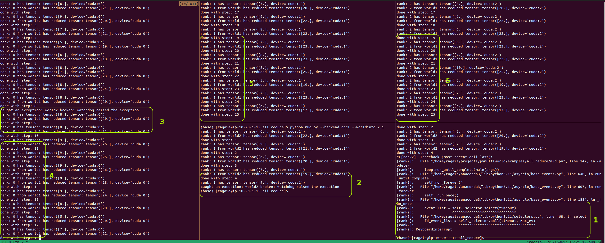

# All Reduce

This file provides an example of collective communication using all_reduce across single and multiple worlds. This exaplme will perform all_reduce 100 times on each rank from each world.

`--worldinfo` argument is composed by the world index(1, 2) and the rank in that world (0, 1 or 2).

## Running the Script in a Single World

The single world example can be executed by opening 3 separate terminal windows to have 3 different processes and running the following commands in each terminal window:

```bash
# on terminal window 1 - will initialize 2 worlds (world1 and world2) with rank 0
python m8d.py --backend nccl --worldinfo 1,0 --worldinfo 2,0
# on terminal window 2 - will initialize world1 with rank 1
python m8d.py --backend nccl --worldinfo 1,1
# on terminal window 3 - will initialize world1 with rank 2
python m8d.py --backend nccl --worldinfo 1,2
```

## Running the Script in Multiple Worlds

The multiple world example can be executed by opening 5 separate terminal windows to have 5 different processes and running the following commands in each terminal window:

```bash
# on terminal window 1 - will initialize 2 worlds (world1 and world2) with rank 0
python m8d.py --backend nccl --worldinfo 1,0 --worldinfo 2,0
# on terminal window 2 - will initialize world1 with rank 1
python m8d.py --backend nccl --worldinfo 1,1
# on terminal window 3 - will initialize world1 with rank 2
python m8d.py --backend nccl --worldinfo 1,2
# on terminal window 4 - will initialize world2 with rank 1
python m8d.py --backend nccl --worldinfo 2,1
# on terminal window 5 - will initialize world2 with rank 2
python m8d.py --backend nccl --worldinfo 2,2
```

To run processes on different hosts, `--addr` arugment can be used witn host's IP address. (`python m8d.py --backend nccl --worldinfo 1,0 --worldinfo 2,0 --addr 10.20.1.50`)

## Example output

Running rank 0 (leader), will have the following output:

```bash
rank: 0 has tensor: tensor([9.], device='cuda:0') # initial tensor for rank 0, world1
rank: 0 has tensor: tensor([9.], device='cuda:0') # initial tensor for rank 0, world2
rank: 0 from world1 has reduced tensor: tensor([21.], device='cuda:0') # reduced tensor for rank 0, world1
done with step: 1 # indicator that step 1 of 100 is done for world1
rank: 0 from world2 has reduced tensor: tensor([27.], device='cuda:0')  # reduced tensor for rank 0, world2
done with step: 1 # indicator that step 1 of 100 is done for world2
```

Running rank 1 from world1, will have the following output:

```bash
rank: 1 has tensor: tensor([7.], device='cuda:1') # initial tensor for rank 1, world1
rank: 1 from world1 has reduced tensor: tensor([21.], device='cuda:1') # reduced tensor for rank 1, world1
done with step: 1 # indicator that step 1 of 100 is done for world2
```

Running rank 2 from world1, will have the following output:

```bash
rank: 2 has tensor: tensor([5.], device='cuda:2') # initial tensor for rank 2, world1
rank: 2 from world1 has reduced tensor: tensor([21.], device='cuda:2') # reduced tensor for rank 2, world1
done with step: 1 # indicator that step 1 of 100 is done for world2
```

The following table provides a visual representation on how all tensors are being reduced accross one world:

| Rank        | Initial tensor                                                 | Result                                                                                                                                                                                                               |
| :---        | :----                                                          | :---                                                                                                                                                                                                                 |
| 0           | <span style="color: red">tensor([9.], device='cuda:0')</span>  | tensor([<span style="color: cyan">21.</span>], device='cuda:0') (<span style="color: red">9</span> + <span style="color: green">7</span> + <span style="color: blue">5</span> = <span style="color: cyan">21</span>) |
| 1           | <span style="color: green">tensor([7.], device='cuda:1')</span>| tensor([<span style="color: cyan">21.</span>], device='cuda:1') (<span style="color: red">9</span> + <span style="color: green">7</span> + <span style="color: blue">5</span> = <span style="color: cyan">21</span>) |
| 2           | <span style="color: blue">tensor([5.], device='cuda:2')</span> | tensor([<span style="color: cyan">21.</span>], device='cuda:2') (<span style="color: red">9</span> + <span style="color: green">7</span> + <span style="color: blue">5</span> = <span style="color: cyan">21</span>) |

The same pattern applies to world2.

## Failure case

If something goes wrong in one worker, only the world where the worker belongs will be affected, the other worlds will continue their workload
In other words, Mutiworld prevents errors from spreading accross multiple worlds.
In this case for example, if rank 2 from world1 will fail the ranks from world2 will continue to perform all_reduce together with rank 0 (leader).

The following screenshot demonstrates how errors are handled in multiworld:

<p align="center"></p>

Explanation:

1. Process is killed using keyboard interrupt on rank 2 from world 2
2. The exception is caught by all the workers in the same world (rank 1 from world 2 in this example)
3. The exception is also caught by the lead worker (rank 0)
4. The lead worker (rank 0) continues communication using all_reduce, even after one of the worlds failed (world 2 in this example)
5. All other workers from all remaining worlds will continue the communication using all_reduce, with the lead worker (rank 0)
