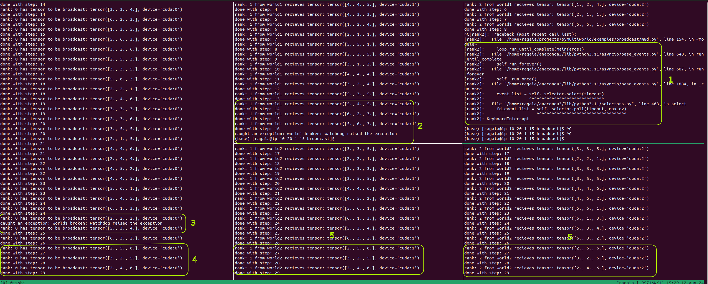

# Broadcast

This file provides an example of collective communication using broadcast across single and multiple worlds. This exaplme will perform broadcast 100 times with a different source on each step, in a range from 0 to 2, based on the world size.

`--worldinfo` argument is composed by the world index(1, 2) and the rank in that world (0, 1 or 2).

## Running the Script in a Single World

The single world example can be executed by opening 3 separate terminal windows to have 3 different processes and running the following commands in each terminal window:

```bash
# on terminal window 1 - will initialize 2 worlds (world1 and world2) with rank 0
python m8d.py --backend nccl --worldinfo 1,0 --worldinfo 2,0
# on terminal window 2 - will initialize world1 with rank 1
python m8d.py --backend nccl --worldinfo 1,1
# on terminal window 3 - will initialize world1 with rank 2
python m8d.py --backend nccl --worldinfo 1,2
```

## Running the Script in Multiple Worlds

The multiple world example can be executed by opening 5 separate terminal windows to have 5 different processes and running the following commands in each terminal window:

```bash
# on terminal window 1 - will initialize 2 worlds (world1 and world2) with rank 0
python m8d.py --backend nccl --worldinfo 1,0 --worldinfo 2,0
# on terminal window 2 - will initialize world1 with rank 1
python m8d.py --backend nccl --worldinfo 1,1
# on terminal window 3 - will initialize world1 with rank 2
python m8d.py --backend nccl --worldinfo 1,2
# on terminal window 4 - will initialize world2 with rank 1
python m8d.py --backend nccl --worldinfo 2,1
# on terminal window 5 - will initialize world2 with rank 2
python m8d.py --backend nccl --worldinfo 2,2
```

To run processes on different hosts, `--addr` arugment can be used witn host's IP address. (`python m8d.py --backend nccl --worldinfo 1,0 --worldinfo 2,0 --addr 10.20.1.50`)

## Example output

Running rank 0 (leader), will have the following output:

```bash
rank: 0 has tensor to be broadcast: tensor([3., 3., 3.], device='cuda:0') # tensor of the source rank for world1
rank: 0 has tensor to be broadcast: tensor([5., 5., 3.], device='cuda:0') # tensor of the source rank for world2
done with step: 1 # indicator that step 1 of 100 is done for world1
done with step: 1 # indicator that step 1 of 100 is done for world2
```

Running rank 1 from world1, will have the following output:

```bash
rank: 1 from world1 recieves tensor: tensor([3., 3., 3.], device='cuda:1') # recieved tensor from the source (rank 0)
done with step: 1 # indicator that step 1 of 100 is done for world1
```

Running rank 2 from world1, will have the following output:

```bash
rank: 2 from world1 recieves tensor: tensor([3., 3., 3.], device='cuda:2') # recieved tensor from the source (rank 0)
done with step: 1 # indicator that step 1 of 100 is done for world1
```

Rank 0 (leader) is the source of the broadcast operation, meaning that it's tensor will be broadcast to every rank from the same world (world1 in this case)
After the operation is done, every worker from the same world will have the same tensor.

The same pattern applies to world2.

## Failure case

If something goes wrong in one worker, only the world where the worker belongs will be affected, the other worlds will continue their workload.
In other words, Mutiworld prevents errors from spreading accross multiple worlds.
In this case, if rank 1 from world2 will fail, ranks from world1 will still receive tensors from the source (rank 0).

The following screenshot demonstrates how errors are handled in multiworld:

<p align="center"></p>

Explanation:

1. Process is killed using keyboard interrupt on rank 2 from world 1
2. The exception is caught by all the workers in the same world (rank 1 from world 1 in this example)
3. The exception is also caught by the lead worker (rank 0)
4. The lead worker (rank 0) continues to broadcast tensors, with the remaining worlds (world 2 in this example)
5. All other workers from all remaining worlds will continue to recieve tensors from the lead worker (rank 0)
